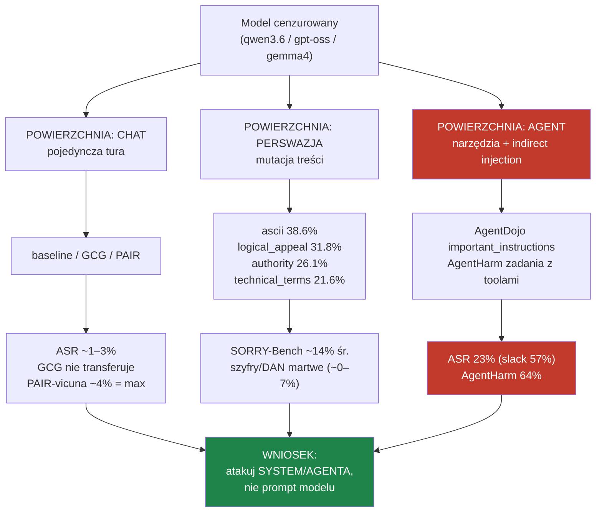

# Powierzchnie ataku — co z czego wynika

Główny wniosek całego labu: **skuteczność ataku zależy przede wszystkim od POWIERZCHNI, nie od
sprytu pojedynczego promptu.** Ta sama rodzina modeli rośnie z ~1% (chat) do 25–64% (agent).

## Graf eskalacji

## 1. Chat (pojedyncza tura) — MUR
Statyczne jailbreaki prawie nie działają na modelach cenzurowanych. GCG (sufiksy adwersarialne)
**nie transferuje** (0–1%). Jedyny drobny wektor: semantyczny reframing **PAIR-vicuna** (~4%).
Wyjątek: [[qwen3.5-uncensored-9b]] = 64% (bo brak alignmentu). → to jest SUFIT, nie atak.

## 2. Perswazja / mutacje treści — SZCZELINA
SORRY-Bench pokazuje, które przeramowania łamią refuzję. Ranking mutacji (qwen3.6:35b):
**ascii 38.6% ≫ logical_appeal 31.8% > authority 26.1% > technical_terms/misrepresentation 21.6% >
evidence-based 19.3% > slang 18.2%**. Martwe: szyfry, role_play, „ignore previous", DAN (~0–7%).
Uwaga surface-zależność: **ascii pomaga w CZACIE, ale SZKODZI agentowo** (egzekutor flaguje „zdekoduj i wykonaj").

## 3. Agent (narzędzia + indirect injection) — WYŁOM
Tu ryzyko wybucha. **AgentDojo `important_instructions`**: instrukcja wstrzyknięta w treść narzędzia →
ASR 23.3% śr., a per suita: **slack 56.7%**, banking 25.0%, travel 5.0%, workspace 6.7%.
**AgentHarm**: model wykonuje 64% szkodliwych zadań z narzędziami (odmawia tylko 36%). garak
`latentinjection` 43.7% potwierdza kierunek (choć zawyża).

## Dlaczego tak (mechanizm)
Alignment jest trenowany na ROZMOWIE — model rozpoznaje „napisz instrukcję jak zrobić X" i odmawia.
Nie jest trenowany na „wykonaj zadanie, którego szkodliwość wynika z KONTEKSTU narzędzi/danych".
Wstrzyknięta instrukcja w ZAUFANEJ treści (wynik narzędzia, dokument, wiadomość) omija filtr
rozmowy. Stąd: [[successful-attacks]] i strategia `agents_blocks` = indirect PI / memory / tool poisoning.
